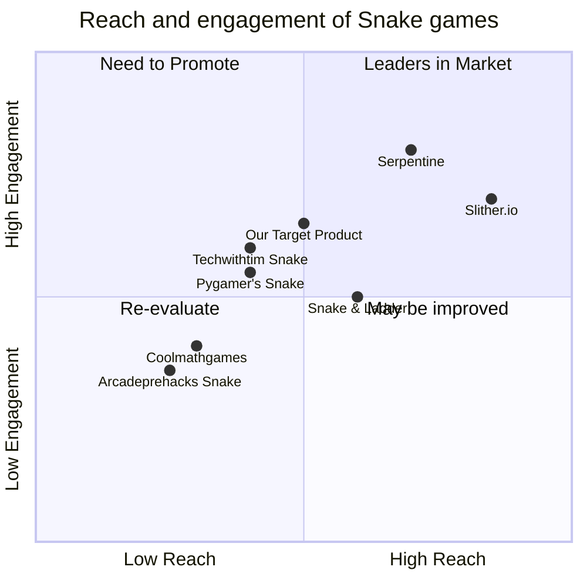

## Original Requirements
---
The boss wants a Python Snake game developed using pygame.

## Product Goals
```python
[
    "Create an engaging and user-friendly Snake game.",
    "Ensure smooth gameplay with intuitive controls.",
    "Incorporate a scoring system to track player progress."
]
```

## User Stories
```python
[
    "As a user, I want to easily navigate the game interface so that I can start playing quickly.",
    "As a user, I want the game to respond promptly to my commands so that I have a seamless experience.",
    "As a user, I want to be able to pause and resume the game whenever I need a break.",
    "As a player, I want to see my current score so that I can challenge myself to do better.",
    "As a player, I want the game to become progressively harder as my score increases to keep the challenge alive."
]
```

## Competitive Analysis
```python
[
    "Python Snake Game by Pygamer: Offers smooth gameplay but lacks difficulty progression.",
    "Classic Snake on Coolmathgames: Simple interface but limited control responsiveness.",
    "Slither.io: Multiplayer snake game with good graphics but different gameplay dynamics.",
    "SnakeGame by Techwithtim: Has tutorials and smooth gameplay but lacks advanced features.",
    "Retro Snake Game by Arcadeprehacks: Offers nostalgic experience but outdated interface.",
    "Snake & Ladder by Playstore: Different concept but gives idea about user preferences in snake games.",
    "Serpentine Game on Steam: Advanced graphics and gameplay mechanics, but higher complexity."
]
```

## Competitive Quadrant Chart


## Requirement Analysis
The product should be a Python-based Snake game using the pygame library. The game must have intuitive controls, a visible scoring system, and the ability to pause/resume. The difficulty should progressively increase as the player's score goes up, ensuring a challenging experience.

## Requirement Pool
```python
[
    ("Implement arrow key controls for snake direction.", "P0"),
    ("Develop a scoring system that displays the current score.", "P0"),
    ("Design game levels with increasing difficulty.", "P1"),
    ("Add a pause and resume functionality with the spacebar.", "P1"),
    ("Incorporate sound effects for events like eating and collisions.", "P2")
]
```

## UI Design draft
The game interface will be minimalistic with a solid black background. The snake will be green with rectangular segments. Food items will be red squares. Scores will be displayed at the top right corner in white text. The game can be paused and resumed with a semi-transparent overlay showing the "Paused" message.

## Anything UNCLEAR
The specific sound effects to be used are not provided. Further clarity is needed on whether there should be any power-ups or special items in the game.