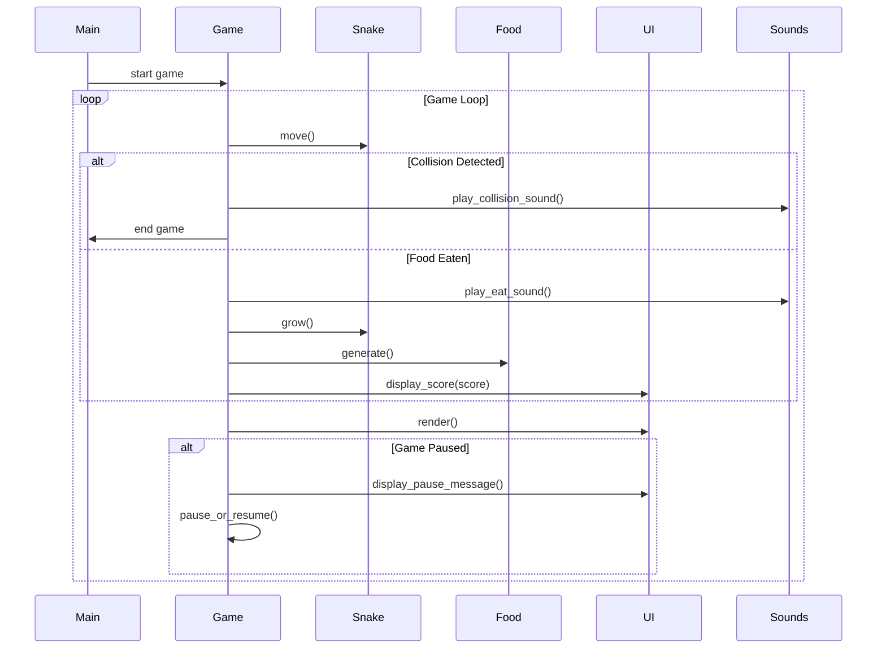

## Implementation approach
To create a state-of-the-art Snake game using pygame, we'll focus on the following:
1. **Modularity**: Break down the game into components like the game loop, snake object, food object, and UI elements.
2. **Performance**: Ensure that the game runs smoothly by optimizing the game loop and reducing unnecessary computations.
3. **User Experience**: Implement intuitive controls, clear visuals, and responsive feedback.
4. **Progressive Difficulty**: Introduce algorithms to increase the speed of the snake as the score increases.
5. **Sound Integration**: Use pygame's mixer module to add sound effects.
6. **Testing**: Use pytest for unit testing to ensure each component works as expected.

## Python package name
```python
"snake_game_py"
```

## File list
```python
[
    "main.py",
    "snake.py",
    "food.py",
    "ui.py",
    "sounds.py",
    "config.py",
    "tests.py"
]
```

## Data structures and interface definitions
```mermaid
classDiagram
    class Game{
        +int score
        +bool is_paused
        +Snake snake
        +Food food
        +UI ui
        +Sounds sounds
        +start()
        +pause_or_resume()
        +update()
        +render()
    }
    class Snake{
        +list segments
        +Direction direction
        +move()
        +grow()
        +check_collision()
    }
    class Food{
        +Point position
        +generate()
    }
    class UI{
        +display_score(int)
        +display_pause_message()
    }
    class Sounds{
        +play_eat_sound()
        +play_collision_sound()
    }
    class Point{
        +int x
        +int y
    }
    enum Direction{
        UP
        DOWN
        LEFT
        RIGHT
    }
    Game "1" -- "1" Snake: controls
    Game "1" -- "1" Food: has
    Game "1" -- "1" UI: displays
    Game "1" -- "1" Sounds: plays
```

## Program call flow


## Anything UNCLEAR
The requirement is clear to me. However, future iterations might consider adding power-ups, multiple levels, or even multiplayer functionality to enhance the game's appeal.